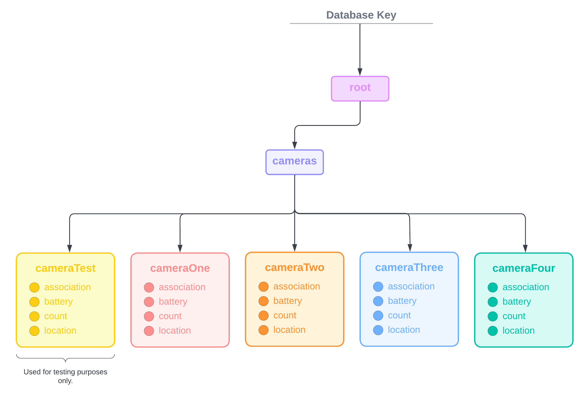

Original App Design - ED1/ED2 FAU
===

# CamCount

## Table of Contents
1. [Overview](#Overview)
2. [Product Logo](#Product-Logo)
3. [Product Spec](#Product-Spec)
4. [Dependencies](#Dependencies)
5. [Wireframes](#Wireframes)
6. [Schema](#Schema)

## Overview
### Description
CamCount is a people counter product that has been designed for the FAU library. CamCount consists of hardware and processing subsystems that connect to a database, which is then used to power the CamCount dashboard application. This is the dashboard application.

The CamCount dashboard software allows users of the CamCount system to view all cameras connected to the CamCount system, their people count tallies, and other data analytics.

### App Evaluation

- **Category:** People Counter Dashboard Application
- **Mobile:** Our application would be primarily designed for mobile use, specifically iOS, but could be adapted for access on a web application. A goal is to abstract the functionality so that the application could have the option to be converted to other platforms in the future.
- **Story:** Allows users to view all cameras connected to the CamCount system, their people count tallies, and other data analytics.
- **Market:** Our application was intentionally created for FAU library staff. However, CamCount is made to be a system that could be scalable.
- **Habit:** The application would allow and encourage users to maintain frequent checks of the amount of people passing in and out of the library.
- **Scope:** CamCount is intended to be for the FAU library to count the quantity of people on certain floors. However, this software could eventually be tailored and expanded for other buildings or businesses. 

## Product Logo
**General Icon**

**Simplified Icon** (For App Icon)

## Product Spec

### 1. User Stories

**Main User Stories**
* User can login.
* User can logout.
* User can view a list of cameras connected in the CamCount system network
* User can view a details screen for each camera on the cameras list.
* User can view and modify settings.

**Optional User Stories**
* User can receive notifications outside of the app.

### 2. Screen Archetypes

* Login/Register
    * Allows user to sign up or log into their account
* Cameras 
    * Shows the list of cameras with their association, location, and battery
* Camera Details
    * Shows the details (specifically the relative people count number and other data analytics) for a specific camera from the Cameras Screen
* Settings
    * Allows user to update their login information 
    * Shows the user information about the team that has developed the application

### 3. Navigation

**Tab Bar Navigation** (Tab to Screen)
* **Cameras**
* **Settings**

**On-Click Navigation** (Tap to Screen)
* **Cameras** -> **Camera Details**

**Flow Navigation** (Screen to Screen)
* **Login** -(upon login success)--> **Cameras** -(upon click or tab bar)--> **Camera Details, Settings**

## Dependencies 
**Pods**
* Charts
* Firebase
    * *Please note that including Firebase in an Xcode project requires downloading all of the necessary libraries that are included in the package.*
    * *Installation procedures for the Firebase SDK package are provided on the Firebase console area.*
* [List will be expanded if necessary.]

***All pods were installed using Cocoapods, one of the most widely used depedency managers for Xcode.***

## Wireframes
**Hand-Sketched Wireframe** 

## Schema 
### Models

#### Users
Authentication will be done by Firebase's authentication system, which is separate from the Realtime Database. 
   
#### Realtime Database

 

### Networking
#### List of Network Requests by Screen
   - **Login Screen**
      - (Read/GET) Verify user via sign in
      - (Update/POST) Create a new user via sign up
   - **Cameras Screen**
      - (Read/GET) Query all cameras from the database
      - (Read/GET) Query all camera associations from the database
      - (Read/GET) Query all camera locations from the database
      - (Read/GET) Query all camera battery levels from the database
   - **Camera Details Screen**
      - (Read/GET) Get relative person count for a specific camera
      - (Read/GET) Get additional data analytics from the database
   - **Settings Screen**
      - (Read/GET) Get user information
      - (Set/POST) Allow a user to change their login information
  

HTTP Verbs | Database Path                                   | Description
----------|-------------------------------------------------|------------
`GET` `SET` `UPDATE`     | /root/cameras/camera<insert#here>/association   | **{STRING}** A camera's association (i.e., FAU)
`GET` `SET` `UPDATE`     | /root/cameras/camera<insert#here>/battery       | **{INT}** A camera's battery number
`GET` `SET` `UPDATE`     | /root/cameras/camera<insert#here>/count         | **{INT}** A camera's relative person count
`GET` `SET` `UPDATE`     | /root/cameras/camera<insert#here>/location      | **{STRING}** A camera's location (i.e., Library 1st Floor)
