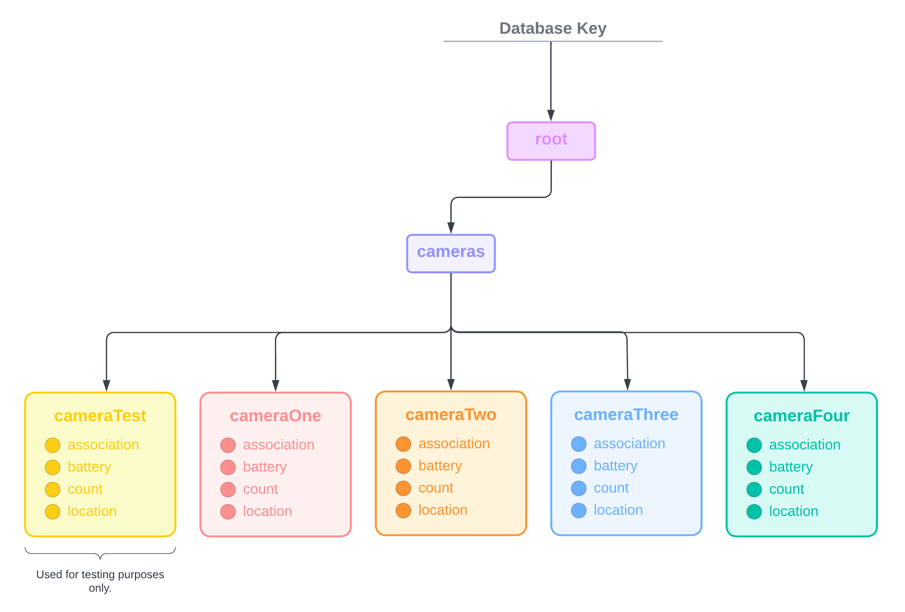

Original App Design for CamCount - Senior Design
===

> [!IMPORTANT] 
> This project was created for learning purposes only. ***Please refrain from copying, sharing, and/or using any of my work.*** Thank you.

> Because GitHub did not allow me to post files greater than the free version file size limit, I was unable to push all of my completed app code to this repo. However, if you would like to see the finished app product, please visit the links below.

- [CamCount FAU Webpage](https://www.fau.edu/engineering/senior-design/projects/spring2023/cam-count-counting-devices/)
- [CamCount Webpage (Includes Information About Team & App Tutorial)](https://sites.google.com/view/camcountfau/home?authuser=0#h.azbn5i9oojjw)
- [CamCount Project Presentation (Includes App Demos & Complete Project Information)](https://youtu.be/k9iEzy10Wuw?si=cFEz22gLuapJ2FNl)

# CamCount

## Table of Contents
1. [Overview](#Overview)
2. [Product Logo](#Product-Logo)
3. [Product Spec](#Product-Spec)
4. [Dependencies](#Dependencies)
5. [Wireframes](#Wireframes)
6. [Schema](#Schema)

## Overview
### Description
CamCount is a people counter product that has been designed for the FAU library. CamCount consists of hardware and processing subsystems that connect to a database, which is then used to power the CamCount dashboard application. This is the dashboard application, solo developed by Paulina DeVito.

The CamCount dashboard software allows users of the CamCount system to view all cameras connected to the CamCount system, their people count tallies, and other data analytics.

### App Evaluation

- **Category:** People Counter Dashboard Application
- **Mobile:** Our application would be primarily designed for mobile use, specifically iOS. A goal is to abstract the functionality so that the application could have the option to be converted to other platforms in the future.
- **Story:** Allows users to view all cameras connected to the CamCount system, their people count tallies, and other data analytics.
- **Market:** Our application was intentionally created for FAU library staff. However, CamCount is made to be a system that could be scalable.
- **Habit:** The application would allow and encourage users to maintain frequent checks of the amount of people passing in and out of the library.
- **Scope:** CamCount is intended to be for the FAU library to count the quantity of people on certain floors. However, this software could eventually be tailored and expanded for other buildings or businesses. 

## Product Logo
**General Icon**

**Simplified Icon** (For App Icon)

## Product Spec

### 1. User Stories

**Main User Stories**
* User can login.
* User can logout.
* User can view a list of cameras connected in the CamCount system network.
* User can view and modify settings.

### 2. Screen Archetypes

* Login/Register
    * Allows user to sign up or log into their account
    * Has forgot password functionality
    * Login persistence throughout app included
* Cameras 
    * Shows the list of cameras with their association, location, and battery
    * Shows if each camera is asleep and/or has a battery warning notification
* Settings
    * Allows user to update their login information 
    * Shows the user information about the team that has developed the application

### 3. Navigation

**Tab Bar Navigation** (Tab to Screen)
* **Cameras**
* **Analytics** (Prototype stage only. Historical data was not able to be obtained due to the project timeline.)
* **Settings**

**Flow Navigation** (Screen to Screen)
* **Login** -(upon login success)--> **Cameras** -(upon click or tab bar)--> **Analytics, Settings**

## Dependencies 
**Pods**
* Charts
* Firebase
    * *Please note that including Firebase in an Xcode project requires downloading all of the necessary libraries that are included in the package.*
    * *Installation procedures for the Firebase SDK package are provided on the Firebase console area.*

***All pods were installed using Cocoapods, one of the most widely used depedency managers for Xcode.***

## Wireframes

**Original, Hand-Sketched Wireframe** 
This was originally created to get an idea of how the app would look. The final product differed slightly.

## Schema 
### Models

#### Users
Authentication will be done by Firebase's authentication system, which is separate from the Realtime Database. 
   
#### Realtime Database
Please note that this database diagram was eventually updated slightly to conform to new updates that happened later on in the project timeline.

 

### Networking
#### List of Network Requests by Screen
   - **Login Screen**
      - (Read/GET) Verify user via sign in
      - (Update/POST) Create a new user via sign up
      - (Update/POST) Allow user to create new login if they forgot their password
   - **Cameras Screen**
      - (Read/GET) Query all cameras from the database
      - (Read/GET) Query all camera associations from the database
      - (Read/GET) Query all camera locations from the database
      - (Read/GET) Query all camera battery levels from the database
      - (Read/GET) Query all camera asleep/awake statuses
      - (Read/GET) Query all camera battery warnings
   - **Settings Screen**
      - (Read/GET) Get user information
      - (Set/POST) Allow a user to change their login information
  

HTTP Verbs | Database Path                                   | Description
----------|-------------------------------------------------|------------
`GET` `SET` `UPDATE`     | /root/cameras/camera<insert#here>/association   | **{STRING}** A camera's association (i.e., FAU)
`GET` `SET` `UPDATE`     | /root/cameras/camera<insert#here>/battery       | **{INT}** A camera's battery number
`GET` `SET` `UPDATE`     | /root/cameras/camera<insert#here>/count         | **{INT}** A camera's relative person count
`GET` `SET` `UPDATE`     | /root/cameras/camera<insert#here>/location      | **{STRING}** A camera's location (i.e., Library 1st Floor)
